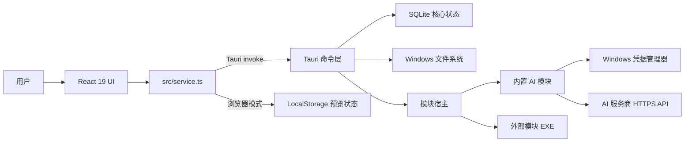
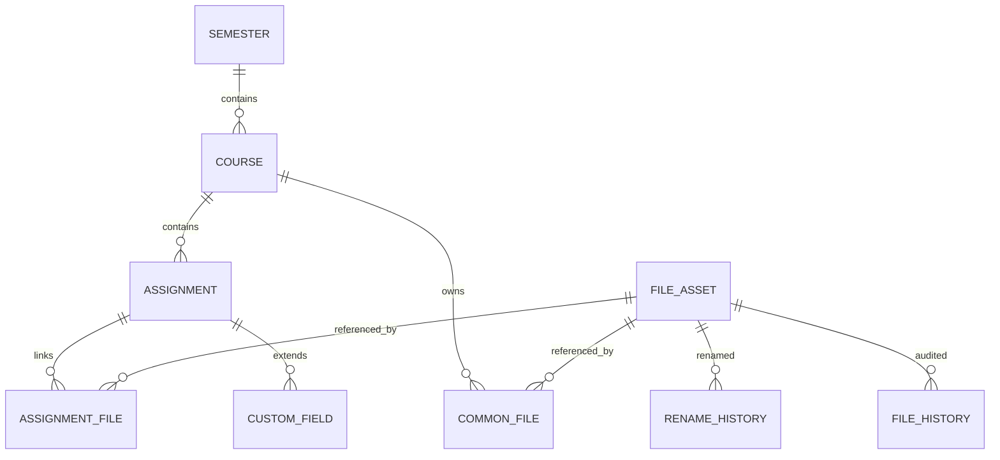
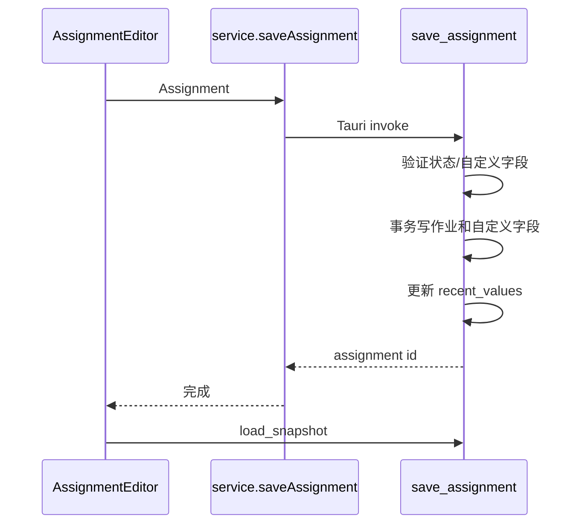
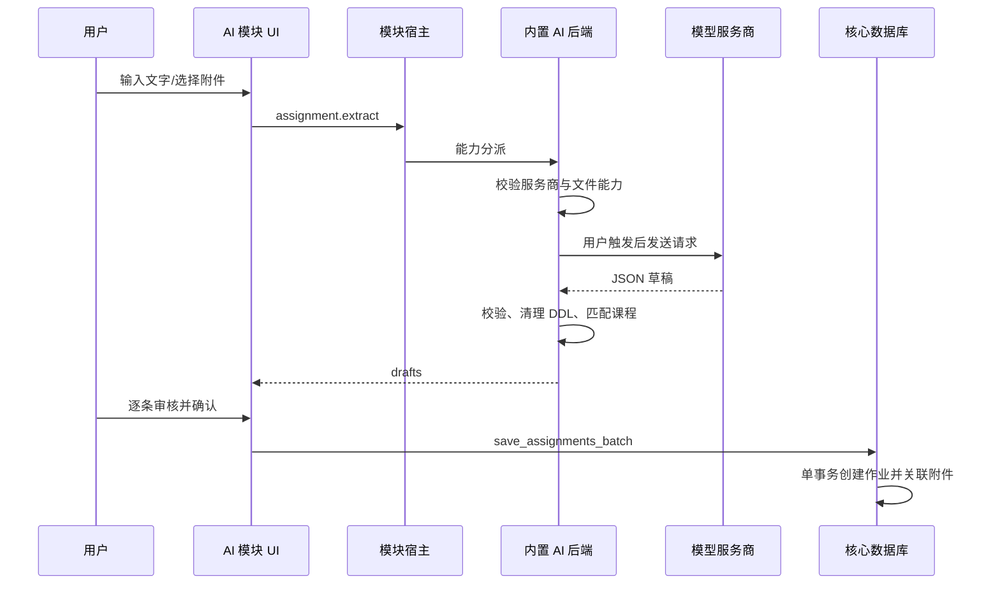
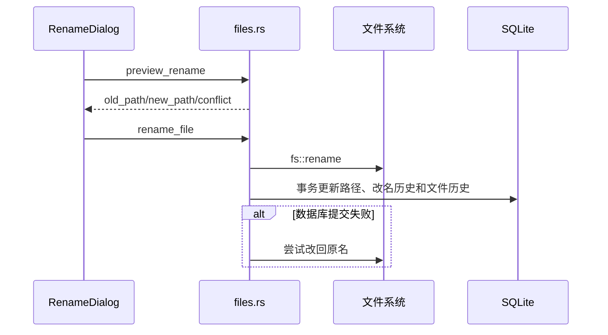

# 系统架构

本文描述作业簿 `v0.4.0` 的运行时架构、领域模型、数据流和一致性边界。面向需要理解或修改实现的维护者；用户操作说明见项目根目录 [README.md](../README.md)，逐项接口见 [CORE_API.md](CORE_API.md)。

## 1. 设计目标

作业簿围绕四个约束设计：

1. **本地优先**：核心数据在本机 SQLite 中，学习文件留在用户自己的目录中；
2. **显式副作用**：网络上传、文件改名、数据库恢复等操作都由用户触发；
3. **可追溯**：文件关联、失效、重新定位和改名有独立历史，而不是只保留当前状态；
4. **核心掌握写权限**：模块负责解析和建议，核心负责持久化、冲突检查和文件系统变更。

## 2. 组件视图



### 2.1 React 前端

前端负责显示、交互状态和用户确认，不直接拼装数据库语句或执行文件操作。

| 文件 | 职责 |
| --- | --- |
| `src/App.tsx` | 应用壳、导航、筛选、选中态、模块入口和刷新协调 |
| `src/pages.tsx` | 文件页与设置页 |
| `src/ui.tsx` | 作业表格、详情、日期/状态展示和通用 UI |
| `src/dialogs.tsx` | 学期与课程编辑器 |
| `src/optimizedDialogs.tsx` | 作业、文件关联和重命名交互 |
| `src/types.ts` | 核心前端数据契约 |
| `src/service.ts` | 桌面/浏览器双实现的类型化服务边界 |

大部分写操作完成后，`App` 会重新调用 `snapshot()`，用后端事实刷新界面，而不是在多个组件中手工维护部分副本。

### 2.2 Tauri 命令层

`src-tauri/src/lib.rs` 是命令注册的唯一入口。它在启动时：

1. 初始化对话框和默认程序打开插件；
2. 解析 AppData 路径；
3. 创建目录并打开 `homework.db`；
4. 建表、执行兼容迁移和初始化模块；
5. 把包含数据库连接与模块目录的 `AppState` 注册到 Tauri；
6. 暴露经过显式列举的命令。

Rust 实现按责任分为：

- `db.rs`：领域记录、完整快照、核心 CRUD、备份/恢复；
- `files.rs`：文件路径、关联、目录浏览、历史、改名与撤回；
- `modules.rs`：内置/外部模块发现、启用状态和调用宿主；
- `modules/assignment-import/backend.rs`：内置 AI 模块及服务商适配。

### 2.3 SQLite

应用维护一个由 `Mutex<Connection>` 包装的进程内连接。主要设置：

- `foreign_keys=ON`：启用级联删除和引用约束；
- `journal_mode=WAL`：改善读取和写入恢复能力；
- `journal_size_limit=1048576`；
- `wal_autocheckpoint=100`；
- `user_version=4`。

数据库是元数据和审计记录的事实来源，但不是实际学习文件的容器。

### 2.4 文件系统层

文件系统层只在用户明确选择或操作文件时访问路径。它承担：

- 规范化绝对路径；
- 检查文件是否存在；
- 在课程根目录内浏览和搜索；
- 原地重命名并同步数据库；
- 用大小和修改时间保护撤回；
- 使用系统默认程序打开文件。

应用不会复制关联文件，也不会因为删除作业、课程或学期而删除磁盘文件。

### 2.5 模块层

模块宿主统一使用能力名分派：

- 内置模块在同一进程中执行；
- 外部模块按需启动独立进程，通过 JSON over stdio 执行；
- 两者都受模块启用状态控制；
- 外部模块还受清单、路径、能力、大小和超时检查。

外部协议详见 [MODULES.md](../MODULES.md)。

## 3. 领域模型



### 3.1 核心实体

| 实体/表 | 作用 | 关键字段 |
| --- | --- | --- |
| `semesters` | 顶层学期容器 | `id`, `name`, `source_root` |
| `courses` | 学期内课程及目录映射 | `semester_id`, `name`, `code`, `folder_path` |
| `assignments` | 作业当前状态 | `course_id`, `title`, `due_at`, `status`, 提交信息、来源信息 |
| `assignment_custom_fields` | 作业可扩展键值 | `assignment_id`, `field_key`, `field_value` |
| `file_assets` | 去重后的当前文件路径 | `id`, 唯一 `path` |
| `assignment_files` | 作业和文件的多对多关联 | `role`, `page`, `chapter`, `problem`, `note` |
| `common_files` | 课程常用文件 | `kind`, `label` |
| `rename_history` | 可撤回改名栈 | 旧/新路径、大小、修改时间、撤回时间 |
| `file_history` | 不随当前关联删除的审计流 | 事件类型、当时路径、作业快照、文件签名 |
| `recent_values` | 表单曾用值 | `field`, `value`, `used_at` |
| `settings` | 核心键值设置 | 主题、命名模板 |
| `module_states` | 模块启用状态 | `module_id`, `enabled`, `updated_at` |

内置 AI 模块另建 `assignment_import_providers` 和 `assignment_import_settings`，避免把模块私有配置加入核心快照。

### 3.2 标识和时间

- 新实体使用 UUID v4；更新操作保留调用方传入的 ID；
- 核心时间字符串使用本机本地时间 `YYYY-MM-DDTHH:mm:ss`；
- 作业 DDL 也使用无时区本地时间，前端按本地时间理解；
- 文件修改时间以 Unix epoch 毫秒保存，只用于变更和撤回安全检查。

### 3.3 删除语义

- 删除学期会级联删除其课程、作业、当前文件关联和常用文件；至少必须保留一个学期；
- 删除作业会级联删除当前关联；
- 删除数据库关联不会删除实际文件；
- 删除前会先写入 `file_history`，所以历史仍能说明文件曾经与什么作业关联；
- 不再被当前关联、常用文件、改名历史或文件历史引用的 `file_assets` 才会被清理。

## 4. Snapshot 读取模型

前端主要通过 `load_snapshot` 一次读取完整核心状态：

```text
Snapshot
├── semesters
├── courses
├── assignments + custom_fields
├── files + missing
├── links
├── common_files
├── renames (最近 100 条)
├── file_history (最近 1000 条)
├── settings
└── recent_values (每个字段最多 12 个)
```

这样做简化了当前规模下的前端联表和状态一致性。代价是数据量增长后读取成本会增加；如果未来出现大量课程和历史，应在不破坏写接口的前提下引入分页或查询接口。

读取快照时，后端还会检查每个仍存在的文件：

- 首次看到文件签名时写入 `tracking_started`；
- 大小或修改时间变化时写入 `content_changed`；
- 不存在的路径只标记 `missing=true`，不自动删除记录。

因此 `load_snapshot` 不是完全无副作用的纯查询，它可能补写文件状态历史。

## 5. 文件历史模型

`file_history.event_type` 当前可能为：

| 事件 | 含义 |
| --- | --- |
| `tracking_started` | 开始记录文件大小与修改时间 |
| `content_changed` | 应用外修改导致文件签名变化 |
| `linked` | 建立作业关联 |
| `link_updated` | 修改关联角色、页码、章节、题号或备注 |
| `unlinked` | 取消关联，或删除上层实体时被移除 |
| `common_added` | 添加为课程常用文件 |
| `common_updated` | 更新常用文件配置 |
| `common_removed` | 移除常用文件 |
| `relocated` | 对失效记录选择了新路径 |
| `renamed` | 应用内原地改名 |
| `rename_undone` | 安全撤回改名 |

历史保存当时的路径和作业标题快照，因此即使作业已删除，文件页仍可展示“曾关联”信息。

## 6. 关键数据流

### 6.1 手动作业保存



### 6.2 批量 AI 导入



识别和保存是两个独立阶段。模型返回成功不意味着数据已经写入，用户关闭审核浮层不会创建作业。

### 6.3 文件改名



撤回时会同时检查：这是该文件最新未撤回记录、当前路径仍为新路径、原路径未被占用、文件大小和修改时间与改名时一致。

### 6.4 备份与恢复

- 导出使用 SQLite backup API，不直接复制可能仍处于 WAL 状态的主文件；
- 恢复先以只读方式打开来源数据库并执行兼容性检查，再替换当前连接的内容；
- 恢复后重新运行核心兼容建表和模块初始化；
- 模块文件、提示词、API Key 和实际学习文件不属于数据库恢复范围。

## 7. 事务和一致性边界

以下操作使用事务保持多表一致：

- 保存作业及其自定义字段；
- 批量创建多项作业并将同一批附件关联到每项作业；
- 删除学期前写文件历史并级联删除；
- 文件改名后更新当前路径、改名记录和历史；
- 撤回改名后更新路径和撤回标记。

文件系统和 SQLite 无法共享真正的原子事务。改名流程采用补偿策略：先执行文件系统改名，再提交数据库；数据库失败时尝试把文件改回。维护相关代码时必须保留这一补偿路径。

## 8. 运行时目录

Tauri 标识符为 `app.homeworkbook.local`。Windows 上主要目录为：

```text
%APPDATA%\app.homeworkbook.local\
├── homework.db
├── homework.db-wal / homework.db-shm   运行期间可能存在
└── modules\
    ├── assignment-import\prompts\      内置模块的用户可编辑提示词
    └── <external-module>\               用户安装的外部模块
```

安装版和便携版由相同标识符解析 AppData，所以共享上述目录。

## 9. 浏览器预览模式

当 `isTauri()` 为 false 时，`src/service.ts` 使用 LocalStorage 中的示例 `Snapshot`：

- 适合开发布局和大部分表单交互；
- 模拟 CRUD、关联、历史和改名结果；
- 不会打开本机文件选择器或默认程序；
- 不运行 SQLite、Rust 校验、凭据管理器或外部模块；
- AI 模块返回固定结构的预览草稿。

因此浏览器构建通过只能证明 TypeScript 和静态资源正确，文件安全和持久化逻辑必须由 Rust 测试或桌面模式验证。

## 10. 安全边界

- API Key 由 `keyring` 的 Windows 原生后端保存，不写入 SQLite；
- AI 服务地址必须是 HTTPS，只有 `localhost` 和 `127.0.0.1` 允许 HTTP；
- 课程目录浏览会规范化请求路径并检查仍位于课程根目录中；
- 外部模块可执行路径必须规范化后仍位于模块目录；
- 外部模块以当前用户权限运行，不是沙箱；
- Tauri CSP 当前为 `null`，因此新增远程前端内容前必须重新评估内容安全策略；
- 应用只应通过受控服务层打开 URL 或文件。

详细安全报告方式见 [SECURITY.md](../SECURITY.md)。

## 11. 扩展方向

适合沿现有边界扩展的方向：

- 新增只产生建议的模块能力；
- 为现有能力增加审核 UI；
- 把大规模 `Snapshot` 拆成兼容的分页查询；
- 为数据库 schema 引入显式顺序迁移；
- 为外部模块增加签名、来源信息和更细粒度授权；
- 增加 Rust 构建缓存和更多 Windows 集成测试；
- 将硬编码首次启动课程模板改为可选 onboarding。

修改公共数据结构或模块能力时，应同步更新 [CORE_API.md](CORE_API.md)、[MODULES.md](../MODULES.md) 和相关测试。
