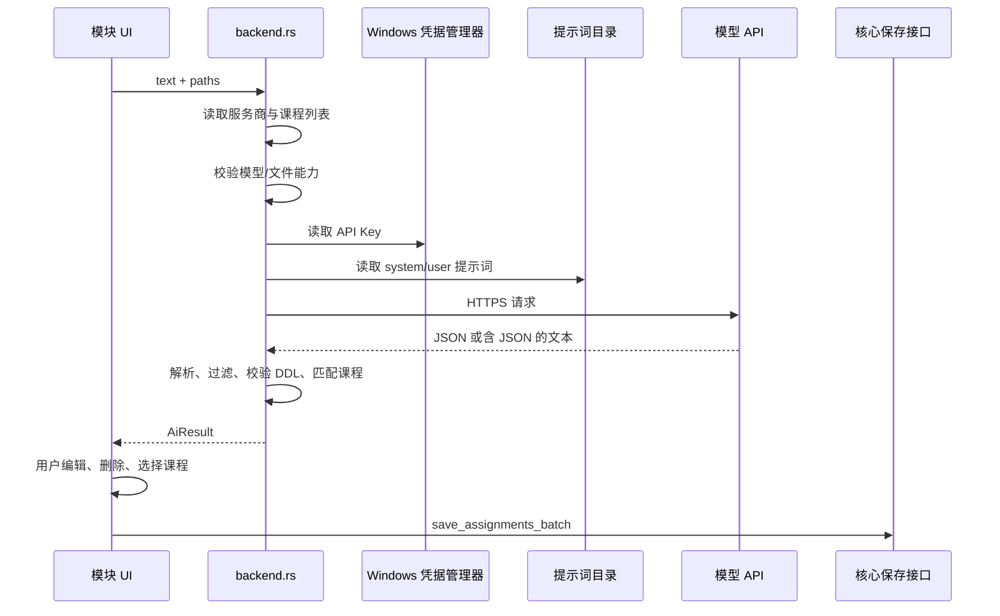

# AI 作业导入模块

- 模块 ID：`builtin.ai.assignment-import`
- 能力：`assignment.extract`
- 当前版本：`0.4.0`

该模块从课程公告文字和用户主动选择的附件中生成一项或多项作业草稿。识别结果必须先进入审核 UI，用户确认后才通过核心批量保存接口写入数据库。模块本身不直接创建作业，也不移动附件。

外部模块协议和 `assignment.extract` 公共契约见项目根目录 [MODULES.md](../../MODULES.md)。本文只介绍这个内置实现。

## 1. 目录结构

```text
assignment-import/
├── module.json                 内置模块描述符
├── backend.rs                  Rust 能力、配置、凭据、提示词和 HTTP 适配
├── provider-presets.json       设置 UI 使用的服务商默认值
├── prompts/
│   ├── assignment_system.txt  系统规则
│   ├── assignment_user.txt    用户消息模板
│   └── legacy/                用于安全迁移旧默认提示词
└── frontend/
    ├── index.tsx               AppModule 入口
    ├── Dialogs.tsx             输入与审核浮层
    ├── SettingsCard.tsx        模块开关、服务商与路由设置
    ├── service.ts              模块前端服务
    ├── types.ts                配置与草稿类型
    └── styles.css              模块样式
```

构建时：

- `src/moduleRegistry.ts` 自动发现 `frontend/index.tsx`；
- `src-tauri/src/modules.rs` 通过 `#[path]` 编译 `backend.rs`；
- `src-tauri/src/lib.rs` 注册模块专用配置命令；
- `module.json` 被 `include_str!` 读取，用来生成后端描述符。

因此修改内置模块源码后必须重新构建应用，不能像外部 EXE 模块一样热安装。

## 2. 前端集成

`frontend/index.tsx` 导出一个 `AppModule`：

- `Action`：在作业页头显示“AI 导入”操作；
- `Overlay`：收集文字/附件、运行识别、审核草稿并保存；
- `SettingsCard`：显示开关、服务商、模型路由和提示词目录。

入口是否可见同时取决于：

1. `moduleRegistry` 是否在构建时发现该模块；
2. 后端 `list_modules` 是否返回相同 ID；
3. `module_states` 中该模块是否启用。

关闭模块只隐藏入口并阻止能力调用，不删除服务商、路由、提示词或历史作业。

## 3. 能力接口

调用：

```ts
service.invokeModule<AiResult>(
  'builtin.ai.assignment-import',
  'assignment.extract',
  {
    text: '课程公告原文',
    paths: ['D:\\course\\notice.pdf'],
  },
)
```

输入：

```ts
interface AiRequest {
  text: string
  paths: string[]
}
```

返回：

```ts
interface AiResult {
  assignments: Array<{
    course_name: string
    course_id: string
    title: string
    description: string
    due_at: string | null
    submission_label: string
    submission_url: string
    submission_notes: string
    evidence: string
  }>
}
```

后端只允许能力名 `assignment.extract`。文字和文件不能同时为空。

## 4. 识别流程



### 4.1 课程匹配

发送给模型的课程列表只包含课程名和课程代码。模型返回后，后端执行不区分大小写的精确匹配：

- `course_name` 唯一匹配课程名或非空代码时，写入内部 `course_id`；
- 没有匹配或出现多个匹配时，`course_id` 留空；
- UI 要求用户在保存前解决未匹配课程。

### 4.2 输出清理

后端允许服务商在 JSON 外包裹少量文字，但会提取首个 `{` 到最后一个 `}` 之间的对象。随后：

- JSON 必须能反序列化为 `AiResult`；
- 删除标题为空的草稿；
- 若最终没有草稿，返回错误；
- `due_at` 必须严格符合 `%Y-%m-%dT%H:%M:%S`，否则改为 `null`；
- 未知课程不自动猜测 ID。

保存前 UI 仍允许用户修改所有业务字段。

## 5. 服务商配置

### 5.1 数据存储

SQLite 表：

```text
assignment_import_providers
├── id
├── name
├── kind
├── base_url
└── model

assignment_import_settings
├── key
└── value
```

设置键包括：

- `assignment_provider_id`：实际用于 `assignment.extract`；
- `material_provider_id`：为未来教材内容匹配预留，当前不发起调用。

API Key 不在这两个表中。它使用 `keyring` 写入 Windows 凭据管理器：

- service：`app.homeworkbook.local`；
- username/account：服务商 UUID。

`get_config` 只返回 `has_key` 布尔值。更新服务商时，API Key 留空表示保留现有值；创建新服务商时必须提供 Key。

### 5.2 URL 校验

服务地址必须是有效 URL，并满足：

- 生产服务使用 `https://`；
- 本地开发允许 `http://localhost`；
- 本地开发允许 `http://127.0.0.1`。

保存时会移除末尾 `/`。Gemini 模型名还限制为字母、数字、连字符、下划线和点。

### 5.3 预设

`provider-presets.json` 仅为设置 UI 提供默认值：

| kind | 默认 base URL | 默认模型 |
| --- | --- | --- |
| `bailian` | `https://dashscope.aliyuncs.com/compatible-mode/v1` | 空，用户选择 |
| `deepseek` | `https://api.deepseek.com` | `deepseek-flash` |
| `gemini` | `https://generativelanguage.googleapis.com/v1beta` | `gemini-2.5-flash` |
| `custom` | 空 | 空 |

预设不是运行时白名单。真正的文件能力由 `kind` 与模型名共同判断。

## 6. 文件能力矩阵

支持扩展名：

- PDF：`.pdf`；
- DOCX：`.docx`；
- 图片：`.png`、`.jpg`、`.jpeg`、`.gif`、`.webp`。

其他扩展名在发请求前被拒绝。每个文件最大 20 MB。

| 类型 | 文字 | 图片 | PDF | DOCX | 传输方式 |
| --- | --- | --- | --- | --- | --- |
| 百炼 `qwen3.8-*` | 是 | 是 | 是 | 否 | OpenAI 兼容多模态内容，Base64 内联 |
| 百炼含 `vl` 的模型 | 是 | 是 | 视具体规则 | 否 | 图片 Base64 内联 |
| 百炼 `qwen-long*` | 是 | 是 | 是 | 是 | 先上传 `/files`，再发送 `fileid://...` |
| 百炼 `qwen-doc-turbo` | 是 | 是 | 是 | 是 | 文件接口；整个请求最多一个文件 |
| DeepSeek `deepseek-flash` | 是 | 是 | 否 | 否 | 图片 Base64 内联 |
| Gemini | 是 | 是 | 是 | 否 | `inline_data` Base64 |
| 自定义 | 是 | 否 | 否 | 否 | OpenAI 兼容文字请求 |

普通请求使用 120 秒 HTTP 超时；附件列表中存在 PDF 时使用 360 秒。

百炼文件接口在请求结束后对已上传 ID 发出 DELETE。清理是尽力而为：删除失败不会覆盖主要识别结果，因此遇到网络异常时应检查服务商后台。

## 7. 服务商请求差异

### 7.1 OpenAI 兼容路径

百炼、DeepSeek 和自定义服务使用：

```text
POST {base_url}/chat/completions
Authorization: Bearer <API Key>
```

请求包含 system/user messages、模型名和 `temperature: 0.1`。结果从 `choices[0].message.content` 读取。

### 7.2 Gemini 原生路径

Gemini 使用：

```text
POST {base_url}/models/{model}:generateContent
x-goog-api-key: <API Key>
```

请求设置 `responseMimeType: application/json` 和 `temperature: 0.1`，文件以 `inline_data` 发送。结果拼接 `candidates[0].content.parts[*].text`。

## 8. 提示词生命周期

编译期默认提示词位于本目录 `prompts/`，运行时副本位于：

```text
%APPDATA%\app.homeworkbook.local\modules\assignment-import\prompts
```

应用启动时对每个提示词执行保守初始化：

- 运行时文件不存在时写入当前默认值；
- 若旧 `%APPDATA%\app.homeworkbook.local\prompts` 中存在用户文件，则迁移到新目录；
- 若现有文件仍等于已知旧默认值，可安全升级为当前默认值；
- 用户修改过的内容保留，不被覆盖。

读取限制：

- UTF-8 文本；
- 每个文件不超过 64 KB；
- 内容不能全为空白；
- `assignment_user.txt` 必须含 `{content}`。

用户模板替换项：

| 占位符 | 值 |
| --- | --- |
| `{date}` | 当前本地日期 `YYYY-MM-DD` |
| `{courses}` | 课程名和代码的 JSON 数组 |
| `{content}` | 用户输入的公告文字 |

附件不插入 `{content}`；它们通过对应服务商的文件/多模态字段单独发送。

## 9. 保存边界

模块的 `saveDrafts` 把审核后的 `AiDraft` 转换为核心 `Assignment`：

- `status` 固定从 `todo` 开始；
- `source_name` 和 `source_text` 来自本次导入 UI；
- `custom_fields` 初始为空；
- 本次选择的所有附件以 `prompt` 角色关联到每个保存的作业。

核心 `save_assignments_batch` 在一个 SQLite 事务中创建全部作业与关联。如果任何标题、路径或文件关联无效，整批回滚。

## 10. 浏览器预览

非 Tauri 环境下，模块配置保存在 LocalStorage 的 `homeworkbook-assignment-import-preview` 键中。`analyze` 返回从输入文字构造的单项演示草稿，不调用模型，也不验证真实服务商权限。

预览模式只能验证 UI，不能证明：

- API Key 保存成功；
- 服务商地址或模型可用；
- PDF/DOCX/图片能力；
- 超时和错误解析；
- 批量数据库事务。

## 11. 测试

运行模块相关测试：

```powershell
cargo test --manifest-path src-tauri/Cargo.toml --lib modules::assignment_import::tests
```

测试覆盖：

- 多作业 JSON 与未知 DDL；
- 未知课程和课程代码匹配；
- qwen、DeepSeek、Gemini 文件能力；
- qwen-doc-turbo 单文件限制；
- Gemini 原生请求结构；
- 提示词占位符和公共前缀；
- 旧服务商、路由和提示词迁移，以及相同服务商 ID 对既有凭据的继续使用；
- 模拟 HTTP 成功响应和超时。

没有真实 API Key 的测试只能验证本地协议、请求结构和错误处理，不能验证服务商账号权限、配额或最新模型可用性。

## 12. 修改检查清单

### 新增服务商类型

1. 扩展前后端 `kind` 联合类型与校验；
2. 更新 `provider-presets.json`；
3. 明确认证头、URL、请求和响应格式；
4. 更新 `check_capability` 和文件传输方式；
5. 添加模拟 HTTP 测试；
6. 更新本 README 与项目根 README 的能力矩阵。

### 修改输出字段

1. 同步 Rust `AiDraft` 和 `frontend/types.ts`；
2. 更新提示词 JSON 约束；
3. 更新审核 UI；
4. 更新 `saveDrafts` 到核心 `Assignment` 的映射；
5. 保留旧模型响应的默认值兼容；
6. 更新 `MODULES.md` 的公共能力契约。

### 修改提示词

保留固定规则在前、运行时日期/课程/公告在后的结构，以提高支持前缀缓存服务商的复用机会。缓存是否命中由模型和服务商决定，不能在产品文案中保证费用下降。
